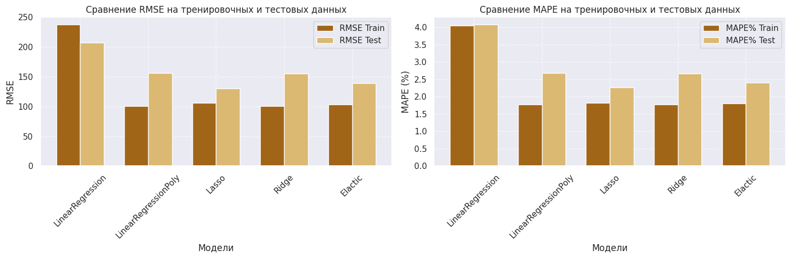

# Forecasting_gas_production

### Оглавление

[Описание проекта](#описание-проекта) 

[Этапы проекта](#этапы-проекта)  

[Структура проекта](#структура-проекта)  

[Используемые библиотеки](#используемые-библиотеки) 

[Заключительные выводы](#заключительные-выводы) 

[Установка и использование](#установка-и-использование)  

### ***Описание проекта***

Проект направлен на сравнение аналитического решения линейной регрессии с готовым решением библиотеки sklearn. А также сравнению моделей линейной регрессии с регуляризацией $L_1$, $L_2$, ElasticNet, а также использование полиноминальных признаков.

Постановка задачи — У Василия, основателя компании «Газ-Таз-Ваз-Нефть», дела идут в гору: у него уже функционирует 200 скважин для добычи газа. В этом году он открывает 30 новых скважин. Однако в целях оптимизации расходов и повышения дохода Василию необходимо оценить, сколько денег будет приносить ему каждая из скважин, а также понять, какие факторы (параметры скважин) потенциально сильнее всего повлияют на объём добычи газа. Для этого Василий решил нанять вас как специалиста в области Data Science.

Василий представляет вам набор данных о добыче газа на своих скважинах. Файл с данными вы можете скачать на платформе.

:arrow_up:[к оглавлению](#оглавление)

### Этапы проекта

* Первичная обработка данных:
  
*Очистка данных от пропусков и выбросов для обеспечения их качества.*

* Разведывательный анализ данных (EDA):
  
*Исследование данных для выявления закономерностей и формулирования гипотез.*

* Отбор и преобразование признаков:
  
*Кодирование и преобразование данных для подготовки к классификации, учитывая их структуру.*

* Построение модели Линейной регресии:
  
*Построение первой модели и оценка её качества.*

* Построение моделей линейной регрессии с регуляризацией ($L_1$/$L_2$/ElasticNet), а также подбор лучших параметров.
  
*Применение методов регуляризации для повышения качества пресказания, а также подбор параметров регуляризации с помощью юиюлиотеки Optuna.*

* Проведение сравнительного анализа, использованных моделей:
  
*Сравним модели и выберем самую подходящую для решения задачи.*

   
:arrow_up:[к оглавлению](#оглавление)

### ***Структура проекта***

- [Forecasting_gas_production(final_version).ipynb](https://github.com/Twi1ightFox/Forecasting_gas_production/blob/master/Forecasting_gas_production(final_version).ipynb): Jupyter ноутбук финальный.
- [Forecasting_gas_production(study_version).ipynb](https://github.com/Twi1ightFox/Forecasting_gas_production/blob/master/Forecasting_gas_production(study_version).ipynb): Jupyter ноутбук шаблон учебный.
- [README.md](https://github.com/Twi1ightFox/Forecasting_gas_production/blob/master/README.md): Описание проекта.
- [graphs](https://github.com/Twi1ightFox/Forecasting_gas_production/tree/master/graphs): Папка с графиками.
- [requirements.txt](https://github.com/Twi1ightFox/Forecasting_gas_production/blob/master/requrements.txt): Зависимости.

:arrow_up:[к оглавлению](#оглавление)

### Используемые библиотеки

Для работы с проектом потребуется установить следующие библиотеки:

- numpy     
- pandas         
- seaborn       
- matplotlib.pyplot  
- sklearn
-  optuna
- другие библиотеки (файл requireents.txt)
:arrow_up:[к оглавлению](#оглавление)

### Заключительные Выводы:
Для предсказания выработки газа были использованы:
* Por — пористость скважины (%);
* AI — акустический импеданс ($кг/м^2 * 10^6$);
* Brittle — коэффициент хрупкости скважины (%);
* VR — коэффициент отражения витринита (%);
+ Сгенерерированные полиноминальные признаки 3 порядка (34 признака)

Признаки из-за наличия мультиколлинеарности или неинформативности были удалены:
* Well — идентификатор скважины;
* Perm — проницаемость скважины;
* TOC — общий органический углерод (%);
* VR — коэффициент отражения витринита (%);

Для сравнения регрессионных моделей были выбраны следующие метрики:

**RMSE (Корень Среднеквадратичной Ошибки)**:

- RMSE измеряет среднюю величину ошибок между предсказанными и фактическими значениями, что дает представление о том, насколько далеко предсказания от фактических значений. Поскольку RMSE основан на квадрате ошибок, он более чувствителен к выбросам или большим ошибкам. Это означает, что модели с меньшим RMSE лучше обрабатывают экстремальные значения и менее склонны к значительным ошибкам. RMSE выражается в тех же единицах, что и целевая переменная (в данном случае, миллионы футов за сутки), что облегчает интерпретацию и понимание величины ошибок в контексте проблемы.

**MAPE (Средняя Абсолютная Процентная Ошибка)**:

- MAPE показывает среднюю величину ошибок в процентах от фактических значений, что предоставляет информацию об относительной точности предсказаний.

RMSE и MAPE дополняют друг друга, предоставляя как абсолютную, так и относительную оценку точности моделей. Это сочетание метрик дает более полную картину сильных и слабых сторон каждой модели.

**Итоговое сравнение метрик моделей**
- 
* Линейная регрессия (LinearRegression) показала самый плохой результат.
* Полиномиальная линейная регрессия (LinearRegressionPoly): Обладает самым низким RMSE на тренировочном наборе (100.81), но на тестовом наборе показатели занимают предпоследнее место(156.00). С метрикой MAPE ситуация точно такая же.
* Эластическая регрессия показала результаты, которые находятся между производительностью Lasso и Ridge для RMSE и MAPE. 

**Лучшие модели:**
Lasso и Ridge: Оба этих метода имеют сопоставимые показатели RMSE и MAPE. Они показали следующие результаты:

Lasso: 
- RMSE_train = 106.40, 
- RMSE_test = 130.69; 
- MAPE%_train = 1.82%, 
- MAPE%_test = 2.27%

Ridge: 
- RMSE_train = 100.88, 
- RMSE_test = 155.02; 
- MAPE%_train = 1.77%, 
- MAPE%_test = 2.67%

Это говорит о том, что оба метода также имеют хорошую обобщающую способность, но Ridge может быть чуть менее стабильным на тестовых данных.

**Выводы:**

Lasso имеет на тестовых данных самые лучшие показатели, к тому же у нее самый маленький разброс между метриками трейна и теста, что говорит о ее стабильности и отсутсвие переобучения. Я бы рекомендовала остановиться на данном этапе именно на этой модели.

Для дальнейшего улучшения считаю нужным рассмотреть другие модели (например, случайные леса, градиентный бустинг), которые могут обеспечить еще лучшие результаты.

:arrow_up:[к оглавлению](#оглавление)

### Установка и использование

1. Клонируйте репозиторий:
   git clone [https://github.com/Twi1ightFox/Forecasting_gas_production.git](https://github.com/Twi1ightFox/Forecasting_gas_production)
   
2. Загрузите необходимые файлы:
   
   (Данные для проекта)[https://lms-cdn.skillfactory.ru/assets/courseware/v1/71b705fb3dda956399b2209697366543/asset-v1:SkillFactory+DSPR-2.0+14JULY2021+type@asset+block/_unconv.zip]
   
3. Запустить Jupyter notebook для просмотра и запуска анализа.

:arrow_up:[к оглавлению](#оглавление)
